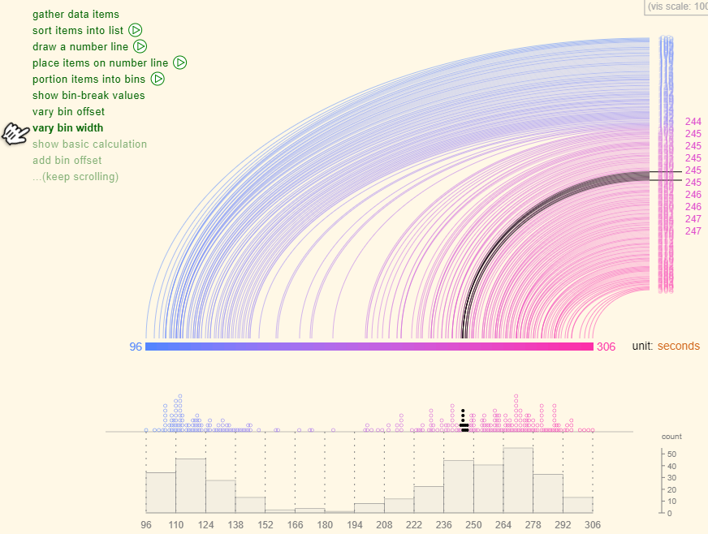

```{r, include = FALSE}
source("R/setup.R")
knitr::opts_chunk$set(
  fig.path = "img/clase00/",
  echo = FALSE,
  fig.width = 10,
  fig.height = 6
  )
```

# Introducción { .center .white data-background="#2f549e"}

## ¿Por qué?

- ¿R?
- ¿Programación?
- ¿Visualización de datos?

## Esquema

> - Visualización en el Análsis + Práctico
> - Introducción al Análisis Exploratorio de Datos + Práctivo
> - Práctico


## Por que vizualización en el análsis

La idea es adentrarnos en el siguiente flujo de datos:


## Visualización en el contexto de datos

Se refiere a la representación gráfica de los datos codificando la información como: posición, tamaño, formas, colores


----

```{r plot1}
library(tidyverse)
legos <- read_csv("https://raw.githubusercontent.com/seankross/lego/master/data-tidy/legosets.csv")
ggplot(legos) + 
  geom_point(aes(Pieces, USD_MSRP, size = Minifigures, color = Year), alpha = 0.5) +
  scale_color_gradientn(colours = c("#440154", "#21908C", "#FDE725")) + 
  scale_y_sqrt(labels = scales::dollar, limits = c(0, 300)) +
  scale_x_sqrt(labels = scales::comma, limits = c(0, 2000)) +
  labs(title = "Distribución de Set de Legos", x = "Piezas", y = "Precio USD")
```

----

```r
library(tidyverse)

url <- "https://raw.githubusercontent.com/seankross/lego/master/data-tidy/legosets.csv"

legos <- read_csv(url)

ggplot(legos) + 
  geom_point(aes(Pieces, USD_MSRP, size = Minifigures, color = Year), alpha = 0.5) +
  scale_color_gradientn(colours = c("#440154", "#21908C", "#FDE725")) + 
  scale_y_sqrt(labels = scales::dollar, limits = c(0, 300)) +
  scale_x_sqrt(labels = scales::comma, limits = c(0, 2000)) +
  labs(title = "Distribución de Set de Legos", x = "Piezas", y = "Precio USD")
```

---- 

```{r plot2}
# install.packages(c("rgexf", "ggnetwork", "intergraph"))
library(igraph)
library(rgexf)
library(stringr)
library(ggnetwork)
library(ggrepel)

net <- "http://media.moviegalaxies.com/gexf/92.gexf" %>% 
  read_lines() %>% 
  read.gexf() %>% 
  gexf.to.igraph()

V(net)$name <- str_to_title(V(net)$name)
V(net)$label <- V(net)$name %>% 
  str_extract_all("^\\w{2}| \\w") %>% 
  map_chr(function(x) {
    x %>% unlist() %>% str_c(collapse = "")
  })
V(net)$size <- page.rank(net)$vector
cl <- cluster_fast_greedy(net)
V(net)$comm <- membership(cl)
V(net)$color <- V(net)$comm

# head(ggnetwork(net))
set.seed(123)
ggnet <- ggnetwork(net)
dfnet2 <- ggnet %>%
  as.matrix() %>%
  as.data.frame() %>%
  tbl_df() %>%
  select(x, y, vertex.names, weight, size) %>%
  mutate_all(as.character) %>%
  mutate_at(vars(x, y, weight, size), as.numeric) %>%
  filter(is.na(weight))

ggplot(ggnet) + 
  geom_edges(aes(x, y, size = width, color = factor(comm),
           xend = xend, yend = yend), color = "gray", size = 1) +
  geom_point(aes(x, y, size = size, color = factor(comm))) +
  geom_text_repel(aes(x, y, label = vertex.names, size = size),
                  data = dfnet2, color = "#666666",
                  family = "Roboto Condensed") +
  scale_color_viridis(discrete = TRUE) + 
  theme_blank() +
  labs(size = "Pagerank", color = "Comunidad")
```

----

Existen muchos tipos de gráficos. Cada uno con su *decodificación*_ (http://tinlizzie.org/histograms/).



----

Si existen muchos


## Ejercicio I - ¿Existe el mejor gráfico?

```{r}
data1 <- read_delim("data/showmethenumbers.txt", delim = "\t") %>% 
  mutate(region = factor(region, levels = c("sur", "norte", "este", "oeste")))
titulo <- "La región del sur exhibe el mayor crecimiento"
data1 %>% 
  spread(cuarto, valor) %>% 
  arrange(region) %>% 
  knitr::kable()
```

Cual de las siguientes formas funciona mejor con el títutlo:

<span class="fragment">
__La región del sur exhibe el mayor crecimiento__
<br>
<small>
Adapatado del tweet de [Lisa Charlotte Rost](https://twitter.com/lisacrost/status/948233069110222848)
que a su vez está viene del ejemplo del libro "Show me the numbers" de Stephen Few
</small>
</span>

----

```{r}
p1 <- ggplot(data1) +
  geom_col(aes(cuarto, valor, group = region, fill = region),
           color = "gray80", position = "dodge") +
  scale_fill_viridis(discrete = TRUE, end = 0.80)
p1 + labs(title = titulo)
```

----

```{r}
p2 <- ggplot(data1) +
  geom_col(aes(region, valor, group = cuarto, fill = region),
           color = "gray80", position = "dodge") +
  scale_fill_viridis(discrete = TRUE, end = 0.80)
p2 + labs(title = titulo)
```

----

```{r}
p3 <- data1 %>% 
  mutate(ind = as.numeric(region == "sur")) %>%
  ggplot() +
  geom_line(aes(cuarto, valor, group = region, alpha = ind, color = region), size = 2) +
  scale_y_continuous(limits = c(0, NA)) + 
  scale_alpha(range = c(0.5, 1), guide = FALSE) +
  scale_color_viridis(discrete = TRUE, end = 0.80) 
p3 + labs(title = titulo)
```

---- 

¿Opiniones?

```{r, fig.height=4}
gridExtra::grid.arrange(
  p1 + theme_null(),
  p2 + theme_null(),
  p3 + theme_null() + scale_y_continuous(limits = c(NA, NA)),
  nrow = 1)
```


## Ejercicio II - ¿Existe el peor gráfico?

Supongamos queremos visualizar

```{r}
legos2 <- legos %>% 
  mutate(Theme2 = fct_lump(Theme, n = 3)) %>% 
  filter(Theme2 != "Other")
legos2 %>% 
  count(Theme) %>% 
  knitr::kable()
```

----

Muy usado es el pie chart

```{r}
p1 <- ggplot(legos2) +
  geom_bar(aes(Theme, fill = Theme)) +
  viridis::scale_fill_viridis(discrete = TRUE, option = "B") +
  theme_null() + 
  xlab(NULL) + ylab(NULL)

p2 <- ggplot(legos2) +
  geom_bar(aes(x = factor(1), fill = Theme), width = 1) +
  viridis::scale_fill_viridis(discrete = TRUE, option = "B") + 
  coord_polar(theta = "y") +
  theme_null()

gridExtra::grid.arrange(p1, p2, nrow = 1)
```

----

Luego nos envian más información

```{r}
legos3 <- legos %>% 
  mutate(Theme2 = fct_lump(Theme, n = 14)) %>% 
  filter(Theme2 != "Other")

bind_cols(
  legos3 %>% count(Theme) %>% head(7),
  legos3 %>% count(Theme) %>% tail(7)
) %>% 
  knitr::kable()
```

----

Muy (ab)usado es el pie chart

```{r}
p1 <- ggplot(legos3) +
  geom_bar(aes(Theme, fill = Theme)) +
  viridis::scale_fill_viridis(discrete = TRUE, option = "B") +
  theme_null() + 
  xlab(NULL) + ylab(NULL)

p2 <- ggplot(legos3) +
  geom_bar(aes(x = factor(1), fill = Theme), width = 1) +
  viridis::scale_fill_viridis(discrete = TRUE, option = "B") + 
  coord_polar(theta = "y") +
  theme_null()

gridExtra::grid.arrange(p1, p2, nrow = 1)
```

----


