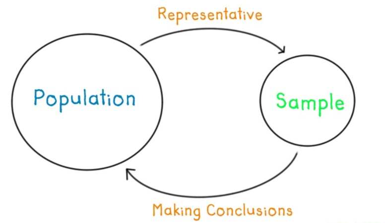

```{r, include = FALSE}
source("R/setup.R")
knitr::opts_chunk$set(
  fig.path = "img/clase01.5/",
  echo = FALSE,
  fig.width = 10,
  fig.height = 6
  )
```

## ¿Qué haremos hoy?

> - Introducción a la Estadística Descripitva. Definiciones. Jerga.
> - Ejemplo guiado
> - práctico

# Estadística { .center .white data-background="#2f549e"}

## Definiciónes

> - Estadística. Rama matemática que estudia observaciones/mediciones de una población (usualmente de una muestra)
> - Población. Conjunto de individuos, elementos de interés (_Pasajeros del Titanic_)
> - Muestra. Una parte (subconjunto) de la población. (_Sobrevivientes del titanic, Rose. No, Leo, no_)

## Tipos de Estadística

Descriptiva e Inferencial



## Distribución

Distribución se relaciona a la forma que varían los datos de medición en medición

Estudiando la forma de como se distribuyen los datos podemos ver cuales son los más comunes, o ver si exsiten casos raros

---

Según la forma de la distribución, existen categorías:


```{r}
n <- 3500

dfdist <- bind_rows(
  data_frame(key = "Simetrica", value = rnorm(n)),
  data_frame(key = "Bimodal", value =  rnorm(n) + ifelse(runif(n) < 0.45, 4, 0)),
  data_frame(key = "Uniforme", value =  runif(n)),
  data_frame(key = "Asimetrica", value = rchisq(n, 3))
) %>%
  mutate(key = factor(key, levels = unique(key))) %>% 
  group_by(key) %>% 
  mutate(value = (value - min(value))/(max(value) - min(value))) %>% 
  ungroup()

dfstats <- dfdist %>% 
  group_by(key) %>% 
  summarise(media = mean(value), mediana = median(value)) %>% 
  gather(stat, value, -key)

ggplot(dfdist) +
  geom_histogram(aes(value, fill = key)) +
  facet_wrap(~key, scales = "free") +
  scale_fill_viridis(discrete = TRUE, begin = .2, end = .8, option = "B") +
  theme_null()
```

## Estadística Descriptiva

Conjunto de procedimientos para __resumir__ datos

- Medidas de tendencia central y dispersión<span class="fragment">. No solo basta con ver que valores puede tomar una variable<span>
- Visualización de datos<span class="fragment">. Distintos gráficos nos cuentan diferente información acerca de la variable(s)<span>

<span class="fragment">__Sintetizar información__<span>


## Medidas de Tendencia y Dispersión

Son indicadores (generalmente un número) obtenidos de los datos 
que __resumen__ información y nos hablan de alguna característica de 
la __distribución__ de la variable

<span class="fragment">Nos ayudan a tener una idea más fina en __donde se concentran__
las variables y que __tan concentrados__ están los valores</span>

## Medidas de Tendencia Central

Nos señalan el valor en _torno al cual se concentran los datos_

>- __Media__ o __Promedio__: La suma de los datos dividido por la cantidad de los mismos
>- Mediana: Es el valor que está al medio cuando los datos se ordenan
>- Moda: Es el valor que más se repite. Este se usa cuando la variable es _discreta_

## Medidas de Dispersión

Son valores que nos describen la dispersión de los datos. Es decir, __que tan concentrados__ están:

>- __Desviación estándar__: Mide el grado de dispersión en torno a la media
>- Rango: Es el tamaño del intervalo que cubren los datos, el mayor valor menos el mínimo
>- Quantiles: Valores donde se acumula % de información

## Ejercicio

Supongamos que debemos decidir en curso debe ir nuestro hijo/sobrino/simil, entre el 
curso __narnajo__ o __azul__. Nos dicen que el promedio de notas finales del año anterior
para cada curso fue.


```{r}
set.seed(123)

N <- 50
curso2 <- rgamma(N, scale = 6.5, shape = 1)
curso2 <- curso2 + rnorm(N)*2
curso2 <- ifelse(curso2 < 4, 4, curso2)
curso2 <- ifelse(curso2 > 7, 7, curso2)

curso1 <- rnorm(50, mean = mean(curso2) - 0.2, sd = 0.25)
curso1 <- ifelse(curso1 < 4, 4, curso1)
curso1 <- ifelse(curso1 > 7, 7, curso1)

# summary(curso1)
# hist(curso1, breaks = 10)


df <- data_frame(
  curso = rep(c("azul", "naranjo"), each = N),
  nota = c(curso2, curso1)
)

df %>% 
  group_by(curso) %>% 
  summarise(
    cantidad_de_alumnos = n(),
    promedio = mean(nota)
    ) %>%
  mutate_if(is.numeric, round, 2) %>% 
  knitr::kable()
```

---- 

Más información:

```{r}
df %>% 
  group_by(curso) %>% 
  summarise(
    cantidad_de_alumnos = n(),
    promedio = mean(nota),
    maxima_nota = max(nota)
    ) %>%
  mutate_if(is.numeric, round, 2) %>% 
  knitr::kable()
```

----

```{r}
ggplot(df) + 
  geom_histogram(aes(nota, fill = curso)) + 
  facet_wrap(~curso) + 
  scale_fill_viridis(discrete = TRUE, begin = .2, end = .8, option = "B") 
```

----

Quizás un poco más de información ayuda

```{r}
df %>% 
  group_by(curso) %>% 
  summarise(
    cantidad_de_alumnos = n(),
    promedio = mean(nota),
    desviacion_estandiar = sd(nota),
    mediana = median(nota),
    minimo = min(nota),
    maximo = max(nota)
    ) %>% 
  gather(estadistico, valor, -curso) %>% 
  spread(curso, valor) %>%
  mutate_if(is.numeric, round, 2) %>% 
  knitr::kable()
```


## Algunas frases

- El promedio no vale mucho sin un indicador de variablidad
- Guiarse por un valor solamente es usualmente peligroso para tomar de decisiones

## Ejemplo ~entrete~ Interactivo

https://rawgit.com/juba/uniquanti/master/index.html


