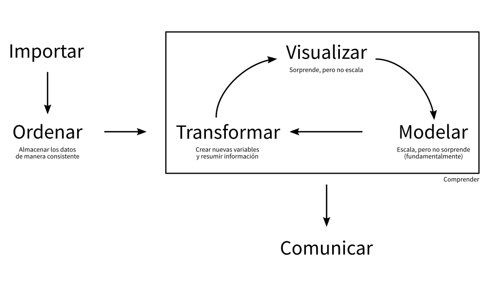

```{r, include = FALSE}
source("R/setup.R")
```

## ¿Qué haremos?

> - Explorar, graficar y agregar datos de los sobrevivientes del Titanic
> - Mediante ejemplos sentar las bases para trabajar **mejor**
> - Perder el miedo a **R**

# Introducción { .center .white data-background="#2f549e"}

## Introducción

La idea es adentrarnos en el siguiente flujo de datos:



## Antes de comenzar

No puedo __explicar__ sin __entender__

<span class="fragment">
El Análisis __Exploratorio__ y la 
Estadística __Descriptiva__ son parte clave 
para el entendimiento</span>

<span class="fragment">`r ico("quote-left")` Escuchar lo que los datos nos hablan</span>

## Conceptos

> - Una __variable__ es una cantidad, que puede ser medida: estatura, magnitud
de un sismo, velocidad de un huracán, etc
> - Un __valor__ es un estado de la variable cuando se mide: 1.20 metros, 8° Richter
> - Una __observación__ o __caso__  es un conjunto de mediciones -no de la misma
variable necesariamente- pero si en un mismo instante y a un mismo objeto.

## Conceptos

> - __Datos tabulados__ es un conjunto de _valores_ cada uno asociado
a una _variable_ y una _observación_


## Conceptos

**Análisis Exploratorio de Datos**

- Generar preguntas acerca de los datos
- Buscar respuestas visualizando, transformando los datos
- Hacer nuevas preguntas a partir de lo aprendido

<span class="fragment">__Generar conocimiento__</span>

# Sobrevivientes del titanic { .center .white data-background="#2f549e"}

## Sobrevivientes del titanic

- Exploraremos los datos del [Titanic](https://www.kaggle.com/c/titanic)
- Cada observación es una persona
- Cada variable es una característica tales como nombre, edad y sobrevivencia.

# Manipulación de datos { .center .white data-background="#2f549e"}

## Ejercicio 1

- Carga el Tidyverse
- Carga los datos
- Explora las primeras observaciones de los datos
- ¿Qué significan estas variables?
- Resume los datos del Titanic (2 formas de hacerlo)
- ¿Se mantienen los resultados si antes de resumir quitas las observaciones con entradas nulas?

## Solución Ejercicio 1

```{r message = FALSE, warning=FALSE}
# Carga el Tidyverse
library(tidyverse)

# Carga los datos
passengers <- read_csv("data/titanic.csv") 
```

----

## Solución Ejercicio 1

```{r message = FALSE, warning=FALSE}
# Explora las primeras observaciones de los datos
passengers
```

----

## Solución Ejercicio 1

```{r message = FALSE}
# Resume los datos del Titanic
summary(passengers)
```

----

## Solución Ejercicio 1

```{r message = FALSE}
# Resume los datos del Titanic usando %>%
passengers %>%
  summary()
```

----

## Solución Ejercicio 1

```{r message = FALSE}
# Resume los datos del Titanic quitando las observaciones con entradas nulas
passengers %>% 
  drop_na() %>% 
  summary()
```

## Recapitulando

- Leíste los datos y los revisaste
- Aprendiste algo acerca del operador `%>%`

## Ejercicio 2: Uso de filter

- Filtra para dejar sólo las observaciones que corresponden a hombres

## Solución Ejercicio 2

```{r message = FALSE}
# Filtra para dejar sólo las observaciones que corresponden a hombres
passengers %>% 
  filter(Sex == "male")
```

## Solución Ejercicio 2

- El código de `dplyr` se puede leer como una frase: toma los datos y luego (`%>%`) filtra de acuerdo a la condición "es de sexo masculino"
- Lo que acabas de hacer *no* altera los datos originales
- `filter(Sex = "male")` es un error común

## Ejercicio 3: Uso de filter

- Filtra para dejar sólo las observaciones que corresponden a mujeres

## Solución Ejercicio 3

```{r message = FALSE}
# Filtra para dejar sólo las observaciones que corresponden a mujeres
passengers %>% 
  filter(Sex == "female")
```

## Ejercicio 4: Uso de arrange

- Ordena las observaciones usando `arrange` de manera creciente de acuerdo al valor de los pasajes (`Fare`)

## Solución Ejercicio 4

```{r message = FALSE}
# Ordena crecientemente por valor del pasaje
passengers %>% 
  arrange(Fare)
```

## Ejercicio 5: Uso de arrange

- Ordena las observaciones usando `arrange` y `desc` de manera decreciente de acuerdo al valor de los pasajes (`Fare`)

## Solución Ejercicio 5

```{r message = FALSE}
# Ordena decrecientemente por valor del pasaje
passengers %>% 
  arrange(desc(Fare))
```

## Ejercicio 6: Uso de mutate

- La variable `Parch` corresponde al número de padres e hijos
- La variable `SibSp` corresponde al número de hermanos y esposas
- Usa `mutate` para combinar ambas variables y crear la variable `FamSize`

## Solución Ejercicio 6

```{r message = FALSE}
# Crea la columna FamSize (tamaño de la familia)
passengers %>% 
  mutate(FamSize = Parch + SibSp)
```

## Acerca de mutate

- `mutate()` se puede usar para crear nuevas columnas pero también para modificar columnas existentes
- e.g. si tengo una variable `peso` expresada en kilos puedo ejecutar `mutate(peso = peso / 1000)` para pasar a toneladas

## Ejercicio 7: Uso de mutate

- ¿Es posible que las familias más numerosas tengan una menor probabilidad de sobrevivir?
- Para corroborar esto crea la nueva variable `FamSize` como la suma de `Parch` y `SibSp` como ya se hizo y luego ordena descendentemente por `FamSize`

## Solución Ejercicio 7

```{r message = FALSE}
# Crea la columna FamSize (tamaño de la familia)
# Ordena descendentemente por FamSize
passengers %>% 
  mutate(FamSize = Parch + SibSp) %>% 
  arrange(desc(FamSize))
```

## Ejercicio 8: Uso de mutate

- Como los ceros y unos no son muy informativos, transforma los valores de `Survived` a "SI" y "NO"
- Crea una nueva tabla

## Solución Ejercicio 8

```{r message = FALSE}
# Transforma Survived en valores "SI" y "NO" (nueva tabla)
passengers1 <- passengers %>% 
  mutate(Survived = ifelse(Survived == 0, "NO", "SI"))
passengers1
```

## Recapitulando

- Leíste los datos y los revisaste
- Aprendiste algo acerca del operador `%>%`
- Ahora puedes usar `dplyr` para manipular datos: filtrar, ordenar y mutar

# Graficar datos { .center .white data-background="#2f549e"}

## Uso de ggplot2

Para graficar usando ggplot2 debes especificar tres elementos:

- Datos
- Estética (e.g cuál variable va en el eje x)
- Capas (e.g. gráfico de barras, puntos, etc)

## Ejercicio 9: Uso de geom_bar

Crea un gráfico de barras de la variable sexo para dar cuenta de cuántos hombres y mujeres iban a bordo del Titanic.

## Solución Ejercicio 9

```{r message = FALSE}
# Gráfico de barras de pasajeros por sexo
ggplot(passengers, aes(x = Sex)) +
  geom_bar()
```

## Ejercicio 10: Uso de geom_point

¿Se correlaciona la edad de los pasajeros con el precio del pasaje?

## Solución Ejercicio 10

```{r message = FALSE}
# Gráfico de puntos de edad vs valor del pasaje
ggplot(passengers, aes(x = Age, y = Fare)) +
  geom_point()
```

## Solución Ejercicio 10

- El código de ggplot2 también se puede leer como una frase al igual que dplyr
- "Tomo los datos del Titanic, llevo Age al eje x y Fare al eje y, luego agrego los datos en forma de puntos"

## Ejercicio 11: Uso de aes

Agrega color por sexo al gráfico anterior para ver si acaso se observa una correlación entre sexo, edad y valor del pasaje:

## Solución Ejercicio 11

```{r message = FALSE}
# Gráfico de puntos de edad vs valor del pasaje coloreado por sexo
ggplot(passengers %>% drop_na(), aes(x = Age, y = Fare, color = Sex)) +
  geom_point()
```

## Ejercicio 12: Uso de facet_grid

¿Cómo lo harías para incorporar la variable sobrevivencia al gráfico anterior y ver si acaso se observa una tendencia?

## Solución Ejercicio 12

```{r message = FALSE}
# Gráfico de puntos de edad vs valor del pasaje coloreado por sexo y separado por sobrevivencia
ggplot(passengers1, aes(x = Age, y = Fare, color = Sex)) +
  geom_point() +
  facet_grid(~Survived)
```

## Ejercicio 13: Uso de geom_bar

Ahora construye un gráfico de barras que se cuenta de la variable sexo, esta vez separado por sobrevivencia.

## Solución Ejercicio 13

```{r message = FALSE}
# Gráfico de barras de pasajeros por sexo separado por sobrevivencia
ggplot(passengers1, aes(x = Sex, fill = Survived)) +
  geom_bar()
```

## Recapitulando

* Leíste los datos y los revisaste
* Aprendiste algo acerca del operador `%>%`
* Ahora puedes usar `dplyr` para manipular datos: filtrar, ordenar y mutar
* Aprendiste lo básico de `ggplot2`.

# Resumir y agregar datos { .center .white data-background="#2f549e"}

## Ejercicio 14: Uso de summarise

Usa `summarise` para encontrar la media del valor del pasaje.

## Solución Ejercicio 14

```{r message = FALSE}
# Calcula la media del valor del pasaje
passengers %>% 
  summarise(meanFare = mean(Fare))
```

## Ejercicio 15: Uso de summarise

Usa `summarise` para encontrar la mediana del valor del pasaje.

## Solución Ejercicio 15

```{r message = FALSE}
# Calcula la media del valor del pasaje
passengers %>% 
  summarise(medianFare = median(Fare))
```

## Ejercicio 16: Uso de summarise

Usa `filter` y `summarise` para encontrar la mediana del valor del pasaje de los hombres.

## Solución Ejercicio 16

```{r message = FALSE}
# Calcula la mediana del valor del pasaje de los hombres
passengers %>% 
  filter(Sex == "male") %>% 
  summarise(meanFare = mean(Fare))
```

## Ejercicio 17: Uso de summarise

Usa `filter` y `summarise` para encontrar la mediana del valor del pasaje de las mujeres.

## Solución Ejercicio 17

```{r message = FALSE}
# Calcula la mediana del valor del pasaje de las mujeres
passengers %>% 
  filter(Sex == "female") %>% 
  summarise(meanFare = mean(Fare))
```

## Ejercicio 18: Uso de summarise

Usa `filter` y `summarise` para encontrar la media del valor del pasaje de las mujeres y cuántas mujeres sobrevivieron.

## Solución Ejercicio 18

```{r message = FALSE}
# Calcula la media del valor del pasaje de las mujeres y cuantas mujeres sobrevivieron
passengers %>% 
  filter(Sex == "female") %>% 
  summarise(meanFare = mean(Fare), numSurv = sum(Survived))
```

## Ejercicio 19: Uso de group_by

Usa `group_by` y `summarise` para encontrar la media del valor del pasaje y el número de sobrevivientes como función del sexo.

## Solución Ejercicio 19

```{r message = FALSE}
# Calcula la media del valor del pasaje y el numero de sobrevivientes agrupado por sexo
passengers %>% 
  group_by(Sex) %>% 
  summarise(meanFare = mean(Fare), numSurv = sum(Survived))
```

## Ejercicio 20: Uso de group_by

Usa `group_by` y `summarise` para encontrar la mediana del valor del pasaje y el número de sobrevivientes como función del sexo.

## Solución Ejercicio 20

```{r message = FALSE}
# Calcula la media del valor del pasaje y el numero de sobrevivientes agrupado por sexo
passengers %>% 
  group_by(Sex) %>% 
  summarise(meanFare = mean(Fare), numSurv = sum(Survived))
```

## Recapitulando

- Leíste los datos y los revisaste
- Aprendiste algo acerca del operador `%>%`
- Ahora puedes usar `dplyr` para manipular datos: filtrar, ordenar y mutar
- Aprendiste lo básico de `ggplot2`.
- Aprendiste a resumir datos teniendo en cuenta múltiples dimensiones tales como sexo, edad, etc

# Dudas { .center .white data-background="#2f549e"}
